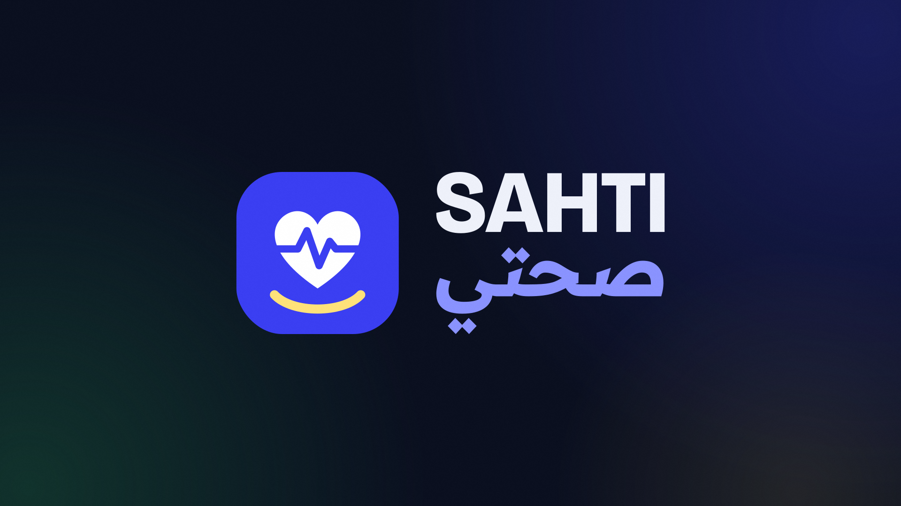
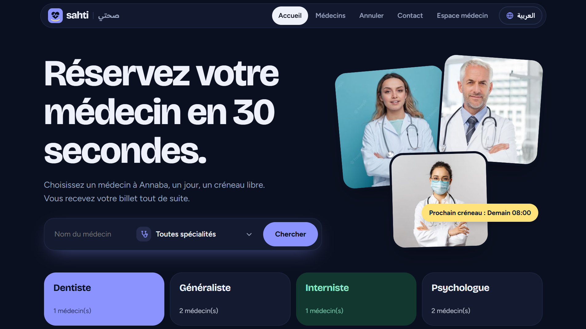
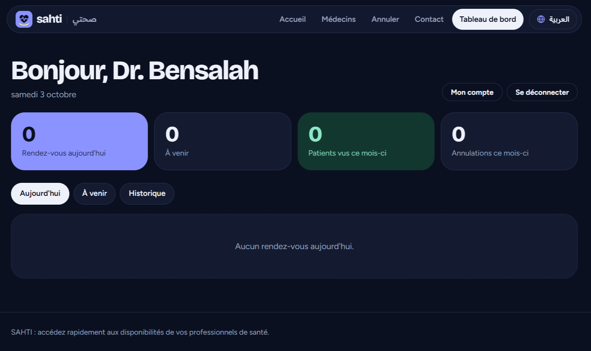

# SAHTI | صحتي

**Book a doctor's appointment in Annaba in under a minute.**

SAHTI is a bilingual (Français / العربية) medical appointment booking website. Patients pick a doctor, a day and a free 30-minute slot, and get a ticket number straight away. Doctors get a private dashboard to follow their appointments, and an administrator manages the whole directory.

It was built as my bachelor's degree project and later modernised and optimised. It uses plain **PHP and MySQL, with no framework and no dependencies**.

## Screenshots

**Home page**: doctor search, specialities, and the next free slot for each doctor




**Doctor dashboard**: today's appointments, upcoming ones, history and monthly statistics



## Features

### For patients
- **Search and filter** doctors by name and speciality
- **Real-time availability**: 30-minute slots based on each clinic's opening hours, bookable from tomorrow up to 14 days ahead
- **Instant ticket** with a booking number after confirmation, no account needed
- **Self-service cancellation** with the ticket number and the phone number used for the booking; the slot becomes free again immediately
- **Contact form** to reach the administrators

### For doctors
- **Private dashboard** with today's appointments, upcoming appointments and history
- **Monthly statistics**: patients seen and cancellations
- **Mark a patient as seen** or **cancel an appointment** (the slot is released)
- **Account page** to change the password
- A doctor only ever sees and acts on **their own patients**

### For the administrator
- Access to **all doctors**, with a filter by doctor
- **Add a doctor** (name, speciality, fee, photo), their **clinic** (name, address, phone, opening hours) and, optionally, a **login account**
- **Inbox** for contact form messages

### General
- **French and Arabic** interface, with a full right-to-left layout for Arabic; the choice is remembered in a cookie
- Responsive, modern dark UI with custom dropdowns

## Security

- Passwords hashed with **bcrypt**; session ID regenerated at login
- **Prepared statements** (PDO) everywhere and systematic output escaping
- **CSRF tokens** on every form and server-side validation
- **Rate limiting**: 5 failed attempts per 10 minutes on login and on cancellation
- **Double-booking is impossible**: a `UNIQUE` constraint on the doctor and the active slot blocks two bookings for the same time, and cancelled slots become free again
- Role checks: doctor-only and admin-only pages

## Tech stack

| Layer | Technology |
|---|---|
| Backend | PHP 8.1+ (no framework) |
| Database | MySQL / MariaDB 10.4+ (PDO) |
| Frontend | HTML, CSS and a little vanilla JavaScript |
| Local server | XAMPP / WAMP, or PHP's built-in server |

## Getting started

### With XAMPP / WAMP

1. Start **Apache** and **MySQL**.
2. In phpMyAdmin, open the *Import* tab and import `database/schema.sql`. It creates the `sahti` database with demo data.
3. Copy this folder to `htdocs/sahti` and open <http://localhost/sahti/>.

### Without XAMPP

```bash
mysql -u root < database/schema.sql
php -S localhost:8000
```

Then open <http://localhost:8000>.

> **Careful:** `schema.sql` drops and recreates the SAHTI tables, so re-importing it erases existing appointments.

### Configuration

By default the app connects to `localhost`, database `sahti`, user `root`, empty password. To change this, set the environment variables `DB_HOST`, `DB_NAME`, `DB_USER` and `DB_PASS`.

In production, create a dedicated MySQL user with only `SELECT`, `INSERT` and `UPDATE` rights on the `sahti` database.

## Demo accounts

Open `/login.php` (the "Espace médecin" link in the menu). All demo accounts use the password `Sahti2026!`.

| Account | Access |
|---|---|
| `doctor1@sahti.dz` to `doctor6@sahti.dz` | Only the patients of the matching doctor |
| `admin@sahti.dz` | All doctors, doctor filter, contact messages, add doctors |

**Change these passwords from "Mon compte" on first login, and before any public deployment.**

## Languages

The button at the top right switches between French and Arabic. French is the base language: Arabic strings live in `lang/ar.php`, where the key is the French text used in the code and the value is its translation. A missing key simply falls back to French, so the site never breaks.

## Project structure

```
sahti/
├── index.php          # Home page
├── doctors.php        # Search and filters
├── book.php           # Booking and ticket
├── cancel.php         # Cancellation (ticket + phone)
├── contact.php        # Contact form
├── login.php          # Doctor / admin login (logout.php)
├── dashboard.php      # Doctor and admin dashboard
├── account.php        # Change password
├── messages.php       # Contact messages (admin)
├── add_doctor.php     # Add a doctor (admin)
├── lib.php            # Database, security, translations, layout
├── lang/ar.php        # Arabic translations
├── assets/            # style.css, select.js, images, doctor photos
└── database/schema.sql  # Schema and demo data
```

To let the admin upload doctor photos, the folder `assets/img/doctors/` must be writable by the web server.

## Roadmap ideas

- Email or SMS confirmation and reminders
- Doctor-defined days off and custom slot lengths
- English interface

## Author

**Abdeldjalil Halisse**: AI Engineer, Université Badji Mokhtar, Annaba.
GitHub: [@djalilhalisse](https://github.com/djalilhalisse)

## License

MIT License

Copyright (c) 2026 Abdeldjalil Halisse

Permission is hereby granted, free of charge, to any person obtaining a copy
of this software and associated documentation files (the "Software"), to deal
in the Software without restriction, including without limitation the rights
to use, copy, modify, merge, publish, distribute, sublicense, and/or sell
copies of the Software, and to permit persons to whom the Software is
furnished to do so, subject to the following conditions:

The above copyright notice and this permission notice shall be included in all
copies or substantial portions of the Software.

THE SOFTWARE IS PROVIDED "AS IS", WITHOUT WARRANTY OF ANY KIND, EXPRESS OR
IMPLIED, INCLUDING BUT NOT LIMITED TO THE WARRANTIES OF MERCHANTABILITY,
FITNESS FOR A PARTICULAR PURPOSE AND NONINFRINGEMENT. IN NO EVENT SHALL THE
AUTHORS OR COPYRIGHT HOLDERS BE LIABLE FOR ANY CLAIM, DAMAGES OR OTHER
LIABILITY, WHETHER IN AN ACTION OF CONTRACT, TORT OR OTHERWISE, ARISING FROM,
OUT OF OR IN CONNECTION WITH THE SOFTWARE OR THE USE OR OTHER DEALINGS IN THE
SOFTWARE.
